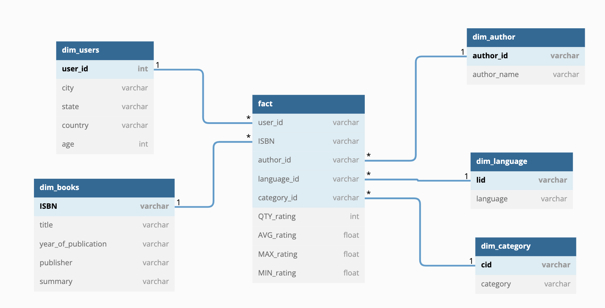
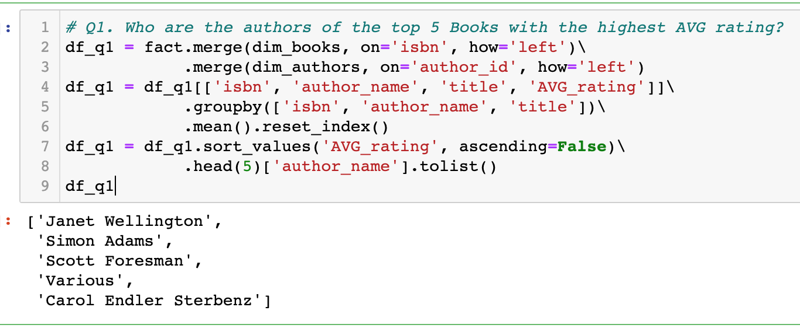
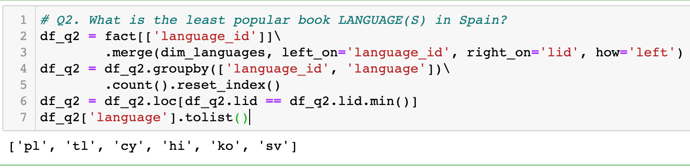

# Book Review Data Pipeline
### Data Engineering Capstone Project

Imagine that your company is collecting book reviews from users for further data analysis. Currently, the main goal is to have some Star Schema for the Data Analysts to create dashboards to present their findings on current book trends and common user ratings.

This project is done

Data Source: 
[Book Rating Dataset from Kaggle](https://www.kaggle.com/datasets/ruchi798/bookcrossing-dataset)

Github does not allow uploading the heaviest file under [data/Books Data with Category Language and Summary/Preprocessed_data.csv](), so I had to remove it from the commit. You can find it in the link above for Kaggle.


## Content
1. [Project Structure](#project-structure)
2. [Pipeline Design](#pipeline-design)
3. [Schema Design](#schema-design)
4. [Sample Queries](#sample-queries-to-test-data-model)

# Project Structure
```
Capstone Project
|____data                                   # table setup script
|    |____Book reviews                      # Source data
|    |____Book Data with Categor...         # Source data (Did not upload)
|    |____model                             # Output - Final tables store
|____images                                 # images for document purposes
|____Book Review Data Pipeline.ipynb        # Main Project workspace
|____Data Dictionary.xlsx                   # Main Project workspace
|____dbdiagram.io.txt                       # Script to generate Schema on dbdiagram.io website
```


# Pipeline Design
The pipeline is implemented locally in [the Jupyter notebook](Book Review Data Pipeline.ipynb). Please take a look there.

# Schema Design


# Sample Queries to test data model
### Q1. Who are the authors of the top 5 Books with the highest AVG rating?

### Q2. What is the least popular book rating LANGUAGE in Spain?

### Q3. Following Q2, for that language, what are the MAX_rating and MIN_rating in canada?
